# 🗂️ Kidville — Schema Database

Diagramma completo dello schema `public`: **83 tabelle** · **141 foreign key** (136 relazioni distinte; più FK tra le stesse due tabelle = una freccia).
Snapshot: **2026-06-30**. La freccia va da *chi contiene la FK* → *tabella referenziata*. Il numero sotto al nome è il conteggio righe.

> **Come condividere:** questo file si renderizza da solo su GitHub/GitLab. Per una versione interattiva (zoom, pan, ricerca, export SVG) apri [`schema.html`](./schema.html) nel browser. Sorgente grezza in [`schema.mmd`](./schema.mmd).

## Domini

| Colore | Dominio | Tabelle |
|---|---|---|
| 🔵 | Anagrafica & Identità | schools, scuole, utenti, alunni, parents, student_parents, legame_genitori_alunni, delegates, sections, utenti_sezioni, utenti_scuole |
| 🟢 | Didattica & Registro | materie, materie_preset, obiettivi_apprendimento, sezione_materia_obiettivo, valutazioni, valutazione_obiettivi, registro_orario, firme_docenti, registro_destinatari, allegati_registro, note_disciplinari, nota_ricezioni, presenze, giustifiche_didattiche, giudizi_sintetici_scala, giudizio_template, eventi_diario, tempo_scuola, campanelle, orario_settimanale, utenti_sezioni_materie |
| 🟣 | Scrutini & Pagelle | scrutinio_periodi, scrutini, scrutinio_giudizi, scrutinio_comportamento, scrutinio_giudizio_descrittivo, pagelle, pagella_ricezioni, certificati_competenze, certificato_competenza_livelli, fascicolo_accessi_audit |
| 🟠 | Mensa | ticket_mensa, mensa_prenotazioni, mensa_menu_rotazione, mensa_menu_override, mensa_menu_config, mensa_class_menu_assignment, gruppi_mensa |
| 🔴 | Pagamenti & Fatturazione | pagamenti, pagamenti_quote, payment_categories, incassi, fatture_numerazione, fatture_emesse |
| 🩵 | Comunicazione | avvisi, avvisi_risposte, chat_threads, chat_messages, notifiche, push_subscriptions, task_interni |
| 🟡 | Documenti, Moduli & FEA | galleria_media, galleria_media_v2, armadietto, locker_config, student_documents, firme_documenti, form_models, form_submissions, forms_templates, forms_submissions, enrollment_submissions, fea_signatures, fea_audit_log, certificati_medici |
| ⚪ | Audit, Config & Sistema | registro_modifiche, sblocchi_audit, audit_scritture_docente, admin_settings, test_table |
| 🟦 | Interoperabilità SIDI | sidi_import_batches, sidi_sync_state |

## Diagramma

```mermaid
graph LR

  %% ======================= DOMINI (subgraph) =======================
  subgraph ANAG["👥 Anagrafica & Identità"]
    schools["schools<br/>1"]
    scuole["scuole<br/>1"]
    utenti["utenti<br/>10"]
    alunni["alunni<br/>128"]
    parents["parents<br/>92"]
    student_parents["student_parents<br/>87"]
    legame_genitori_alunni["legame_genitori_alunni<br/>7"]
    delegates["delegates<br/>0"]
    sections["sections<br/>10"]
    utenti_sezioni["utenti_sezioni<br/>8"]
    utenti_scuole["utenti_scuole<br/>0"]
  end

  subgraph DID["📚 Didattica & Registro"]
    materie["materie<br/>56"]
    materie_preset["materie_preset<br/>65"]
    obiettivi_apprendimento["obiettivi_apprendimento<br/>7"]
    sezione_materia_obiettivo["sezione_materia_obiettivo<br/>4"]
    valutazioni["valutazioni<br/>13"]
    valutazione_obiettivi["valutazione_obiettivi<br/>1"]
    registro_orario["registro_orario<br/>9"]
    firme_docenti["firme_docenti<br/>9"]
    registro_destinatari["registro_destinatari<br/>1"]
    allegati_registro["allegati_registro<br/>0"]
    note_disciplinari["note_disciplinari<br/>1"]
    nota_ricezioni["nota_ricezioni<br/>0"]
    presenze["presenze<br/>63"]
    giustifiche_didattiche["giustifiche_didattiche<br/>3"]
    giudizi_sintetici_scala["giudizi_sintetici_scala<br/>6"]
    giudizio_template["giudizio_template<br/>9"]
    eventi_diario["eventi_diario<br/>76"]
    tempo_scuola["tempo_scuola<br/>6"]
    campanelle["campanelle<br/>130"]
    orario_settimanale["orario_settimanale<br/>40"]
    utenti_sezioni_materie["utenti_sezioni_materie<br/>56"]
  end

  subgraph SCR["🎓 Scrutini & Pagelle"]
    scrutinio_periodi["scrutinio_periodi<br/>1"]
    scrutini["scrutini<br/>3"]
    scrutinio_giudizi["scrutinio_giudizi<br/>367"]
    scrutinio_comportamento["scrutinio_comportamento<br/>32"]
    scrutinio_giudizio_descrittivo["scrutinio_giudizio_descrittivo<br/>18"]
    pagelle["pagelle<br/>32"]
    pagella_ricezioni["pagella_ricezioni<br/>2"]
    certificati_competenze["certificati_competenze<br/>0"]
    certificato_competenza_livelli["certificato_competenza_livelli<br/>0"]
    fascicolo_accessi_audit["fascicolo_accessi_audit<br/>3"]
  end

  subgraph MENSA["🍽️ Mensa"]
    ticket_mensa["ticket_mensa<br/>7"]
    mensa_prenotazioni["mensa_prenotazioni<br/>10"]
    mensa_menu_rotazione["mensa_menu_rotazione<br/>5"]
    mensa_menu_override["mensa_menu_override<br/>1"]
    mensa_menu_config["mensa_menu_config<br/>1"]
    mensa_class_menu_assignment["mensa_class_menu_assignment<br/>1"]
    gruppi_mensa["gruppi_mensa<br/>0"]
  end

  subgraph PAY["💶 Pagamenti & Fatturazione"]
    pagamenti["pagamenti<br/>1095"]
    pagamenti_quote["pagamenti_quote<br/>0"]
    payment_categories["payment_categories<br/>5"]
    incassi["incassi<br/>15"]
    fatture_numerazione["fatture_numerazione<br/>0"]
    fatture_emesse["fatture_emesse<br/>0"]
  end

  subgraph COM["💬 Comunicazione"]
    avvisi["avvisi<br/>4"]
    avvisi_risposte["avvisi_risposte<br/>9"]
    chat_threads["chat_threads<br/>3"]
    chat_messages["chat_messages<br/>17"]
    notifiche["notifiche<br/>15"]
    push_subscriptions["push_subscriptions<br/>1"]
    task_interni["task_interni<br/>7"]
  end

  subgraph DOC["📎 Documenti, Moduli & FEA"]
    galleria_media["galleria_media<br/>0"]
    galleria_media_v2["galleria_media_v2<br/>12"]
    armadietto["armadietto<br/>51"]
    locker_config["locker_config<br/>7"]
    student_documents["student_documents<br/>0"]
    firme_documenti["firme_documenti<br/>0"]
    form_models["form_models<br/>3"]
    form_submissions["form_submissions<br/>3"]
    forms_templates["forms_templates<br/>2"]
    forms_submissions["forms_submissions<br/>1"]
    enrollment_submissions["enrollment_submissions<br/>2"]
    fea_signatures["fea_signatures<br/>0"]
    fea_audit_log["fea_audit_log<br/>0"]
    certificati_medici["certificati_medici<br/>0"]
  end

  subgraph SYS["⚙️ Audit, Config & Sistema"]
    registro_modifiche["registro_modifiche<br/>15"]
    sblocchi_audit["sblocchi_audit<br/>0"]
    audit_scritture_docente["audit_scritture_docente<br/>0"]
    admin_settings["admin_settings<br/>1"]
    test_table["test_table<br/>0"]
  end

  subgraph SIDI["🔌 Interoperabilità SIDI"]
    sidi_import_batches["sidi_import_batches<br/>0"]
    sidi_sync_state["sidi_sync_state<br/>0"]
  end

  %% ======================= RELAZIONI (FK) =======================
  admin_settings --> schools
  allegati_registro --> utenti
  allegati_registro --> registro_orario
  alunni --> gruppi_mensa
  alunni --> schools
  alunni --> sections
  armadietto --> alunni
  armadietto --> schools
  audit_scritture_docente --> utenti
  audit_scritture_docente --> schools
  audit_scritture_docente --> sections
  avvisi --> utenti
  avvisi --> schools
  avvisi_risposte --> avvisi
  avvisi_risposte --> utenti
  avvisi_risposte --> alunni
  campanelle --> sections
  certificati_competenze --> alunni
  certificati_competenze --> scrutini
  certificati_competenze --> sections
  certificati_medici --> alunni
  certificato_competenza_livelli --> certificati_competenze
  chat_messages --> utenti
  chat_messages --> chat_threads
  chat_threads --> utenti
  chat_threads --> alunni
  delegates --> alunni
  eventi_diario --> alunni
  eventi_diario --> utenti
  fascicolo_accessi_audit --> alunni
  fascicolo_accessi_audit --> utenti
  fatture_emesse --> pagamenti
  firme_docenti --> registro_orario
  firme_documenti --> utenti
  form_submissions --> form_models
  forms_submissions --> forms_templates
  galleria_media --> utenti
  galleria_media --> schools
  galleria_media_v2 --> utenti
  giudizi_sintetici_scala --> schools
  giudizio_template --> schools
  giustifiche_didattiche --> alunni
  giustifiche_didattiche --> materie
  giustifiche_didattiche --> sections
  incassi --> pagamenti
  incassi --> pagamenti_quote
  incassi --> utenti
  legame_genitori_alunni --> alunni
  legame_genitori_alunni --> utenti
  materie --> schools
  materie --> sections
  mensa_class_menu_assignment --> mensa_menu_config
  mensa_class_menu_assignment --> schools
  mensa_menu_config --> schools
  mensa_menu_override --> mensa_menu_config
  mensa_menu_override --> schools
  mensa_menu_rotazione --> mensa_menu_config
  mensa_menu_rotazione --> schools
  mensa_prenotazioni --> alunni
  mensa_prenotazioni --> utenti
  mensa_prenotazioni --> schools
  nota_ricezioni --> alunni
  nota_ricezioni --> note_disciplinari
  note_disciplinari --> alunni
  note_disciplinari --> sections
  notifiche --> utenti
  obiettivi_apprendimento --> schools
  orario_settimanale --> campanelle
  orario_settimanale --> utenti
  orario_settimanale --> materie
  orario_settimanale --> sections
  pagamenti --> alunni
  pagamenti --> payment_categories
  pagamenti --> utenti
  pagamenti --> pagamenti
  pagamenti --> schools
  pagamenti_quote --> utenti
  pagamenti_quote --> pagamenti
  pagella_ricezioni --> alunni
  pagella_ricezioni --> scrutini
  pagelle --> alunni
  pagelle --> utenti
  pagelle --> scrutini
  payment_categories --> schools
  presenze --> alunni
  presenze --> utenti
  presenze --> schools
  presenze --> sections
  push_subscriptions --> utenti
  registro_destinatari --> alunni
  registro_destinatari --> firme_docenti
  registro_destinatari --> registro_orario
  registro_modifiche --> utenti
  registro_orario --> materie
  registro_orario --> schools
  registro_orario --> sections
  sblocchi_audit --> utenti
  scrutini --> utenti
  scrutini --> scrutinio_periodi
  scrutini --> sections
  scrutinio_comportamento --> alunni
  scrutinio_comportamento --> scrutini
  scrutinio_giudizi --> alunni
  scrutinio_giudizi --> materie
  scrutinio_giudizi --> utenti
  scrutinio_giudizi --> scrutini
  scrutinio_giudizio_descrittivo --> scrutinio_periodi
  scrutinio_giudizio_descrittivo --> schools
  scrutinio_periodi --> schools
  sections --> schools
  sezione_materia_obiettivo --> materie
  sezione_materia_obiettivo --> obiettivi_apprendimento
  sezione_materia_obiettivo --> sections
  student_documents --> utenti
  student_documents --> sections
  student_documents --> alunni
  student_parents --> parents
  student_parents --> alunni
  task_interni --> utenti
  task_interni --> schools
  tempo_scuola --> sections
  ticket_mensa --> alunni
  utenti --> schools
  utenti_scuole --> schools
  utenti_scuole --> utenti
  utenti_sezioni --> sections
  utenti_sezioni --> utenti
  utenti_sezioni_materie --> materie
  utenti_sezioni_materie --> sections
  utenti_sezioni_materie --> utenti
  valutazione_obiettivi --> obiettivi_apprendimento
  valutazione_obiettivi --> valutazioni
  valutazioni --> alunni
  valutazioni --> utenti
  valutazioni --> materie
  valutazioni --> sections

  %% ======================= STILI =======================
  classDef anag  fill:#dbeafe,stroke:#2563eb,color:#1e3a8a;
  classDef did   fill:#dcfce7,stroke:#16a34a,color:#14532d;
  classDef scr   fill:#ede9fe,stroke:#7c3aed,color:#4c1d95;
  classDef mensa fill:#ffedd5,stroke:#ea580c,color:#7c2d12;
  classDef pay   fill:#fee2e2,stroke:#dc2626,color:#7f1d1d;
  classDef com   fill:#cffafe,stroke:#0891b2,color:#164e63;
  classDef doc   fill:#fef9c3,stroke:#ca8a04,color:#713f12;
  classDef sys   fill:#e5e7eb,stroke:#4b5563,color:#1f2937;
  classDef sidi  fill:#e0e7ff,stroke:#4f46e5,color:#312e81;

  class schools,scuole,utenti,alunni,parents,student_parents,legame_genitori_alunni,delegates,sections,utenti_sezioni,utenti_scuole anag;
  class materie,materie_preset,obiettivi_apprendimento,sezione_materia_obiettivo,valutazioni,valutazione_obiettivi,registro_orario,firme_docenti,registro_destinatari,allegati_registro,note_disciplinari,nota_ricezioni,presenze,giustifiche_didattiche,giudizi_sintetici_scala,giudizio_template,eventi_diario,tempo_scuola,campanelle,orario_settimanale,utenti_sezioni_materie did;
  class scrutinio_periodi,scrutini,scrutinio_giudizi,scrutinio_comportamento,scrutinio_giudizio_descrittivo,pagelle,pagella_ricezioni,certificati_competenze,certificato_competenza_livelli,fascicolo_accessi_audit scr;
  class ticket_mensa,mensa_prenotazioni,mensa_menu_rotazione,mensa_menu_override,mensa_menu_config,mensa_class_menu_assignment,gruppi_mensa mensa;
  class pagamenti,pagamenti_quote,payment_categories,incassi,fatture_numerazione,fatture_emesse pay;
  class avvisi,avvisi_risposte,chat_threads,chat_messages,notifiche,push_subscriptions,task_interni com;
  class galleria_media,galleria_media_v2,armadietto,locker_config,student_documents,firme_documenti,form_models,form_submissions,forms_templates,forms_submissions,enrollment_submissions,fea_signatures,fea_audit_log,certificati_medici doc;
  class registro_modifiche,sblocchi_audit,audit_scritture_docente,admin_settings,test_table sys;
  class sidi_import_batches,sidi_sync_state sidi;

```

